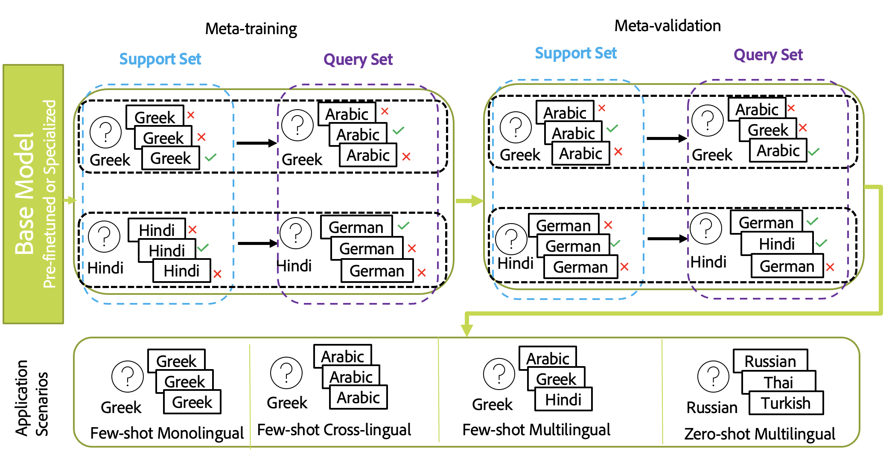
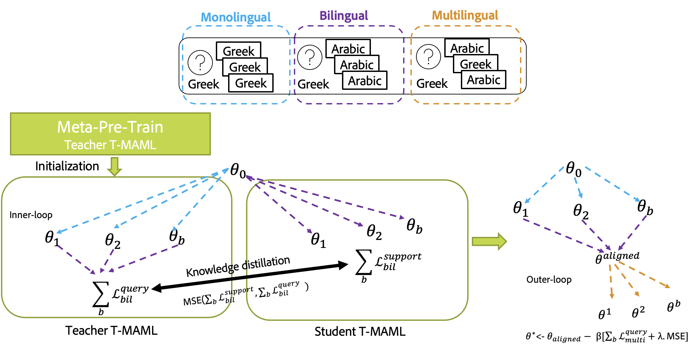

# Multilingual Semantic Search using Meta-Learning:

This is a pytorch/learn2learn implementation for multilingual semantic search using different flavors of meta-learning. We propose two algorithms T-MAML and T-MAML2T-MAML. T-MAML is an adaptation of meta-transfer learning to multilingual semantic search whereas T-MAML2T-MAML is a fusion of meta-learning and knowledge distillation techniques to smoothen the alignment processes between different modes of semantic search: monolingual, bilingual, and multilingual.

## Table of Contents:

1. [Abstract](#abstract)
2. [Set up your environment](#setupenv)
3. [Run the setup script](#runsetup)
4. [Python installation and system PATH](#pythonpath)
5. [Download Visual Studio Code (vscode)](#vscode)
6. [Unit testing and visual debugging](#unitests)
7. [Entry points](#entrypoints)
8. [Datasets](#datasets)
9. [Meta-Tasks for Multilingual Semantic Search](#metatasks)
10. [T-MAML](#t-maml)
11. [T-MAML2T-MAML](#t-maml2t-maml)
12. [Citation](#citation)
13. [Credits](#credits)

## 1. Abstract <a name="abstract"></a>:

Given the sheer amount of work done on monolingual retrieval/search and its extension to multilingual scenarios using machine translation, we focus in this paper on developing an efficient solution to multilingual semantic search with less reliance on machine translation. Machine translation solutions are often not efficient and not feasible as the retrieved content in the search can be from multiple languages and it is hard to predict which language combinations are involved in real-time. 
We aim to reduce the gap between different languages used in the query and to be retrieved sentences. We aim to democratize multilingual semantic search for low-resource evaluation and ad-hoc semantic search. For that purpose, we propose a meta-learning approach based on MAML and show its gain compared to standard fine-tuning. We compare to different external baselines based on machine translation and knowledge distillation and propose an alignment approach based on meta-distillation learning to align monolingual and cross-lingual semantic search to multilingual semantic search. 

## 2. Set up your environment <a name="setupenv"></a>

### 2.1. Install Conda <a name="installconda"></a>

You should have [conda](https://docs.conda.io/en/latest/) installed on your machine. If you don't you can use the the Conda package manager can be installed locally at any desired location on your system. 

- If on mac (also works for M1), run the [install-conda.sh](tools/install-conda.sh) script (no sudo needed)
    ```
    bash tools/install-conda.sh /path/to/install
    ```
- If on windows , run the [install-conda.ps1](tools/install-conda.ps1) script (no admin access needed)
    ```
    powershell tools/install-conda.ps1 \path\to\install
    ```

### 2.2. Activating Conda <a name="activateconda"></a>

Here, I assume that you installed conda in `~/.miniconda3` for mac and `C:/miniconda3 `for windows.

After conda is installed, depending on what os and terminal you have, add these to that 
- Mac add to ~/.bash_profile and ~/.zshrc for bash and zsh, respectively.
  ```terminal
  source ~/.miniconda3/bin/activate
  ```
- windows powershell, add to $PROFILE (do `echo $PROFILE` in powershell to see where this file should be)
  ```terminal
  & C:\miniconda3\shell\condabin\conda-hook.ps1
  ```
- windows git bash, add to ~/.bash_profile
  ```terminal
  source /c/miniconda3/etc/profile.d/conda.sh
  ```

## 3. Run the setup script <a name="runsetup"></a>

Based on your OS/Terminal combination, you need to add the following commands to initialize your terminal environment correctly. All the setup commands must be run from the repository root.  The first time you run this script it may take a while to install minconda, python, and any dependencies.  Subsequent runs of the script should be much faster.

### 3.1. Windows + Powershell <a name="windows"></a>

Powershell (not CMD) is recommended on Windows. We recomend using [Windows Terminal](https://www.microsoft.com/en-us/p/windows-terminal/9n0dx20hk701) which provides a nice developer experience that supports powershell and several quality-of-life features like tabs, sensible copy-paste, Unicode support, etc.  

```
& tools\setup.ps1
```

### 3.2. Linux/MacOS + bash <a name="mac"></a>

Note that `zsh` is the default on MacOS these days.  We don't guarantee this will work with `zsh` but it is [pretty easy to switch to `bash`](https://www.howtogeek.com/444596/how-to-change-the-default-shell-to-bash-in-macos-catalina/).

```
source tools/setup.sh
```

## 4. Python installation and system PATH <a name="pythonpath"></a>
* You do not need python installed separately, the setup command took care of it for you (enter `which python` in your terminal to confirm that you are now using the python installed in this project's virtual environment).  You should see `.venv` listed as the active virtual environment in your terminal now, just before the prompt.

```
(.venv) $ 
```

* You do not need to add `sys.path.append` at the beginning of your python scripts, the setup commands will make sure that your package (`multi_meta_ssd` in our case) is available to your python.

* Each time you create a new terminal and `cd` to the repo location, you will need to activate the virtual environment.

```
$ conda activate .venv/
```

* If you changed the dependencies in `tools/conda.yaml` or in `setup.py`, then you will need to `conda deactivate` and run the setup script again, in order to update your virtual environment.  

## 5. Download Visual Studio Code (vscode) <a name="vscode"></a>

Visual Studio Code (hereinafter referred to as __vscode__) offers a very nice development experience with auto complete, linting and debugger integration. It is highly recommeded to use vscode for development. You can download vscode from here: https://code.visualstudio.com/download

Once downloaded, open the vscode app and take care of a few one-time setup steps.

1. Click the  button and type "python" into the search bar.  Install the "Python" extension. (first result)

   

2. (Mac-only) Press Ctrl+Shift+P, type "shell", and select the "Shell Command: Install 'code' command in PATH" entry.
3. Close VS Code.  We'll reopen it later from the terminal, with the `code` command.

We recommend using one of the standard Python linters, such as `pylint` or `flake8`.

## 6. Unit testing and visual debugging <a name="unitests"></a>

All the tests go into `tests` folder. Test input data should be kept under `data` which is saved in artifactory. Test temp output files will be created in the `.tmp_test_out` folder.

### 6.1. Running the tests <a name="runtests"></a>

You can run the tests with the `python tests/main.py` command.

If you like to run all the tests in the debugger, where you can add break points in vscode, open vscode, click on the little bug icon on the left, and click on the Play button.

To run a single test, open the test file in vscode, click on the lab flask icon on the left, then click on the rotating arrow.

Once you do this after a few seconds, on top of your test, there will be a `debug` text, click on that to run that specific test.

### 6.2. Adding a new test <a name="addnewtests"></a>

Test should be inside `.py` files that start with the name `test_` and are inside the `tests` folder. They can also be in a subfolder of `tests`, but all subfolders must contain an `__init__.py` (even empty) file.

Here is an example of a simple test file:
```py
from multi_meta_ssd.multi_meta_ssd_test_case import MultiMetaSSDTestCase

# Tests are functions starting with `test_` of a class inheritting from `MultiMetaSSDTestCase`.
# All functions within the same class share the same setUp() and tearDown() functions.
class TestGroup1(MultiMetaSSDTestCase):
    def setUp(): #optional setup run once per every test functions
        pass

    def tearDown(): #optional tearDown run once per every test functions
        pass

    @classmethod
    def setUpClass(cls): #optional setup run once per test class
        pass

    @classmethod
    def tearDownClass(cls): #optional tearDown run once per test class
        pass

    def test_1(self): # test functions should start with
        sample_file = self.get_fixture_path("sample-file.txt")
        content = self.read_file(sample_file).strip()
        self.assertEqual(content, "Hello I am a fixture for testing.")

    def test_2(self):
        # another test
```
Every test class inherits from `MultiMetaSSDTestCase` class which in turn inherits from `unittest.TestCase`. Therefore it has a series of functions available to it for [assertions](https://docs.python.org/3/library/unittest.html#test-cases) and other [utility](./multi_meta_ssd/MultiMetaSSDTestCase.py).

If you need to temporarily disable a test, you can simply change the function name so that it no longer starts with `test_`.  For example, `test_example_fixture` would be skipped if you renamed it to be `do_not_test_example_fixture`.

## 7. Entry points <a name="entrypoints"></a>

All entry points of the multi_meta_ssd package are managed through a single script `multi_meta_ssd` which resides in `multi_meta_ssd/commands/main.py : main_cmd()`. Each entry point has to have a file named `create_<entry_point>_parser` (e.g., [asymsearch.py](multi_meta_ssd/commands/asymsearch.py) and [asymsearch_kd.py](multi_meta_ssd/commands/asymsearch_kd.py)). These then should be called in [main.py](multi_meta_ssd/commands/main.py).

You can try the current entry points
```
# Entry point 1, for multi-purpose running of different fine-tuning, zero-shot and T-MAML experiments:
multi_meta_ssd asymsearch 

# Entry point 2, for multi-purpose running of different T-MAML2T-MAML experiments:
multi_meta_ssd asymsearch_kd

# Entry point 3, for splitting the data into 5 fold cross-validation splits:
multi_meta_ssd split_lareqa_cross_val

# Entry point 4, for performance evaluation of different models:
multi_meta_ssd perf_eval_options

# Entry point 5 to get the statistics of the dataset:
multi_meta_ssd get_stats

# Entry point 5, for symmetric search:
multi_meta_ssd sym_eval

```

### 7.1. Details of scripts and config files <a name="configfiles"></a>

For setup, the following describes the functionality of each script:
- `tools/setup.ps1`: Run this in powershell in windows with `& tools/setup.ps1` from the project root directory before starting development. If you open a new powershell window or tab, run this script again.
- `tools/setup.cmd`: Run this in cmd.exe in windows with `call tools/setup.cmd` from the project root directory before starting development. If you open a new cmd.exe window, run this script again.
- `tools/setup.sh`: Run this in bash in mac or linux with `source tools/setup.sh` from the project root directory before starting development. If you open a new bash window,run this script again.
- `setup.py`: This is internally used by the `setup.ps1|cmd|sh` scripts. This will install your code in dev mode, so that python always sees your package when your conda env is active. Also it will install your package entry points. So for example, from the commands like `multi_meta_ssd_ep1` is always recognized and runs `multi_meta_ssd/commands/ep1.py`.
- `tools/lint.sh`: Run the python linter. It will tell you potential errors in the code. Linter config are stored in the `.pylintrc` file.
- `tool/coverage.sh`: Run your tests and also report how much of your code is covered by the tests. Coverage config are stored in the `.coveragerc` file.
- `tools/artifact.py`, `tools/tiny.yaml`, `tools/artifctory.manifest`: artifactory integration.
- `tools/conda.yaml`: requirements of the project which will be installed by conda.

For an exhaustive list of scripts that can used for different experiments refer to `multi_meta_ssd/scripts/`.

## 8. Datasets <a name="datasets"></a>
This code works mainly for LaReQA which is downloadable from this [repository](https://github.com/google-research-datasets/lareqa). The code automatically preprocesses from scratch this dataset depending on which languages are specified in the script options or reloads the previously processed set of questions and candidates saved along with the meta-tasks.
## 9. Meta-Tasks for Multilingual Semantic Search <a name="metatasks"></a>

## 10. T-MAML <a name="t-maml"></a>
The code for T-MAML is mainly in upstream models `multi_meta_ssd/models/upstream/maml.py`.




## 11. T-MAML2T-MAML <a name="t-maml2t-maml"></a>
The code for T-MAML2T-MAML is mainly in upstream models `multi_meta_ssd/models/upstream/maml_align.py`.



## 12. Citation <a name="citation"></a>
Coming soon

## 13. Credits <a name="credits"></a>

This scaffold is a fork of the [python-scaffold](https://git.corp.adobe.com/3di/python-scaffold) repo by the titans at 3DI. We simply removed the Artifactory and the Jenkins sections. Additional credits from them: 

This scaffold is greatly inspired by the [metabuild](https://git.corp.adobe.com/meta-build/meta-build) project. Artifactory integration is provided by [tiny](https://git.corp.adobe.com/lagrange/tiny).  The [3DI Tech Transfer team](https://wiki.corp.adobe.com/display/3DI/3DI+tech+transfer+team) maintains this template repo. 
